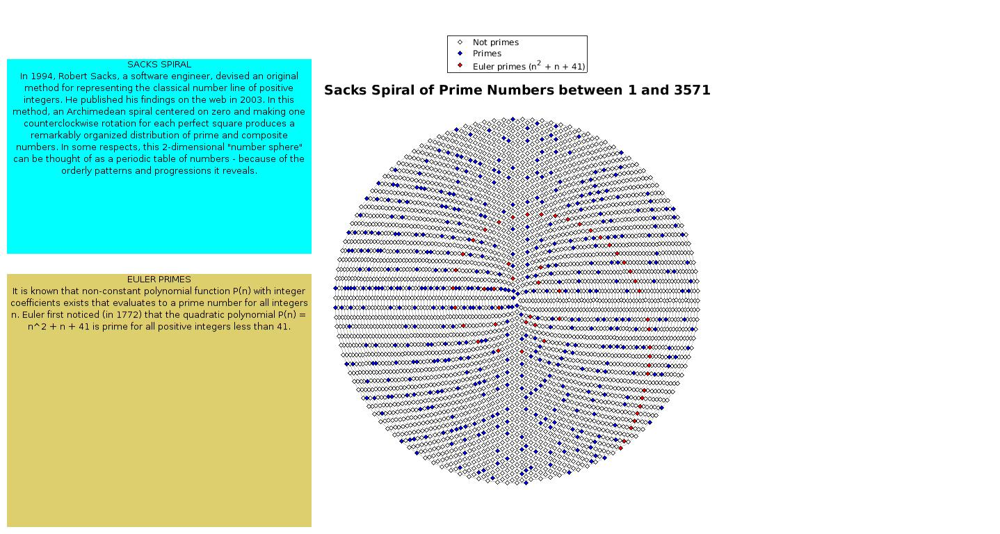

## 📘 Overview
primespiral is an interactive MATLAB function for exploring the distribution of prime numbers arranged into spiral patterns.  
It brings together several classic integer-spiral visualizations and allows highlighting many well-known prime families within a chosen range.

The function is interactive by default (dialog-driven selection of spiral and family).  
It also supports an optional parametric mode for scripted use when inputs are provided.

## ✨ Features
- Four supported spiral layouts:
  - Ulam spiral
  - Sacks spiral
  - Vogel spiral
  - Archimede spiral
- Interactive selection of:
  - spiral type
  - prime family
- Optional parametric (non-UI) usage for reproducible scripts
- Dozens of classic and special prime families in one visual explorer
- Explicit plain-text in-code definitions for each prime family
- UI-oriented Cancel handling to avoid hard errors
- Minor adjustments aimed at keeping the visualization responsive for larger ranges

## 🧩 Selection Logic
- The option “Primes and Sacks axes” is available only when the Sacks spiral is selected.
- In interactive mode, very large ranges on the Archimede spiral can reduce readability; the function may suggest scaling down for clarity.

## 📥 Installation
1. Download or clone the repository:
   https://github.com/dnafinder/primespiral

2. Add the folder to your MATLAB path:
   addpath('path_to_primespiral')

3. Ensure the main file is present:
   - primespiral.m

## ⚙️ Requirements
- MATLAB (any recent version with basic graphics support)

## 🚀 Usage
Interactive mode (default):

   primespiral

You will be prompted to:
1. Select a spiral.
2. Select a prime family.
3. View the spiral with the selected family highlighted.

Parametric mode (examples):

   primesout = primespiral(3571,'Spiral','Ulam','Family','Only Primes');

   primesout = primespiral(10000,'Spiral','Sacks','Family','Twin primes','Interactive',false);

## 🖼️ Screenshot

## 🧠 Notes
- The explorer is designed to stay faithful to a compact, visual, “quick and dirty” spirit while improving robustness and documentation.
- Some families are implemented via known finite lists or small-range constructions (for example, Genocchi prime reduces to the single value 17 within range).
- For Bell primes, the description is:
  Bell numbers that are prime (small range).

## 🧾 Citation
If you use primespiral in research, teaching, or publications, please cite:

Cardillo G. (2014–2025). Primespiral: Play into the world of prime numbers!  
Available at: https://github.com/dnafinder/primespiral

## 👤 Author
Giuseppe Cardillo  
Email: giuseppe.cardillo.75@gmail.com  
GitHub: https://github.com/dnafinder

## 📄 License
The code is provided as-is, without any explicit warranty.  
Please refer to the repository for licensing details if a LICENSE file is present.
